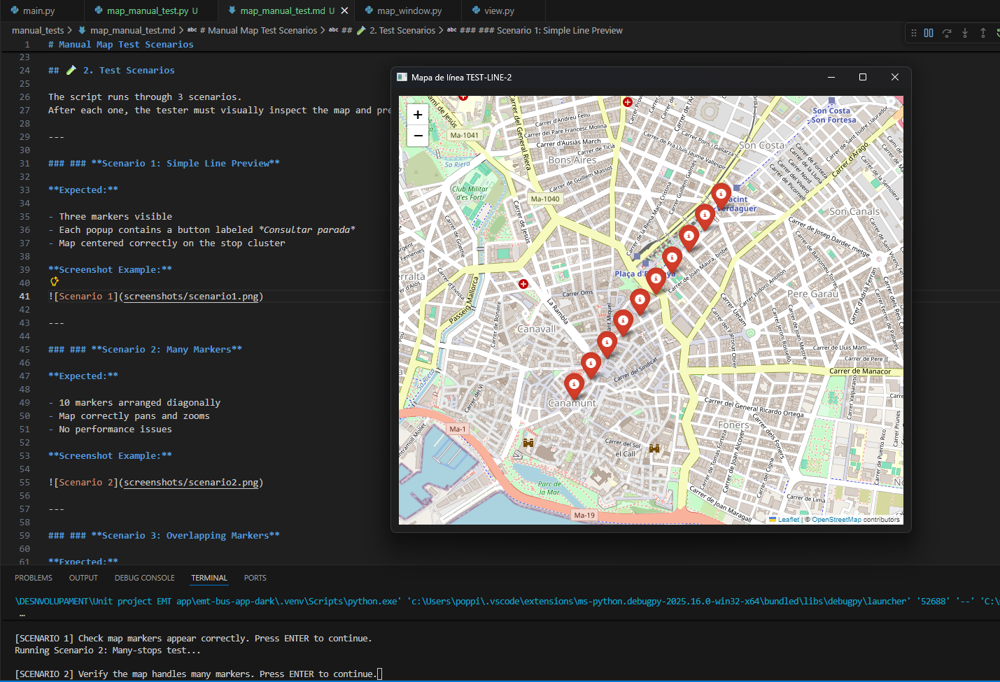
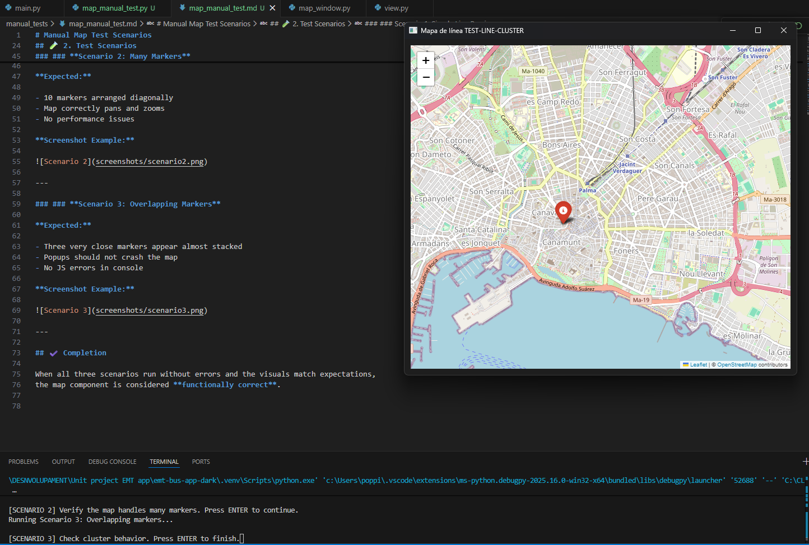

# Manual Map Test Scenarios

This document describes how to manually run and verify the map component used in our EMT Bus App.

These tests run **outside the main application**, using fake data, so developers can verify:

- Leaflet map loading
- Marker placement accuracy
- Popup and stop-selection behavior
- Visual rendering in PyQt6 WebEngine

---

 1. How to Run the Test Script

Open a terminal inside your project folder:

If everything is installed correctly (`PyQt6-WebEngine`, `folium`, etc.),  
a window will open showing a test map.

---

## 🧪 2. Test Scenarios

The script runs through 3 scenarios.  
After each one, the tester must visually inspect the map and press **ENTER** to continue.

---

### ### **Scenario 1: Simple Line Preview**

**Expected:**

- Three markers visible
- Each popup contains a button labeled *Consultar parada*
- Map centered correctly on the stop cluster

**Screenshot Example:**

[Scenario 1](screenshots/scenario1.png)

---

### ### **Scenario 2: Many Markers**

**Expected:**

- 10 markers arranged diagonally
- Map correctly pans and zooms
- No performance issues

**Screenshot Example:**

---

### ### **Scenario 3: Overlapping Markers**

**Expected:**

- Three very close markers appear almost stacked
- Popups should not crash the map
- No JS errors in console

**Screenshot Example:**

---

## ✔️ Completion

When all three scenarios run without errors and the visuals match expectations,
the map component is considered **functionally correct**.

